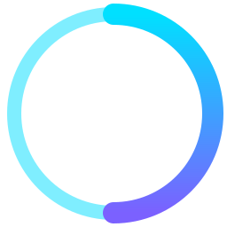

  

  <h1 align="center">Hi there 👋, I'm Abdul Kalam</h1>
  <h3 align="center">A Passionate Creator, Innovator, and Lifelong Learner from India</h3>

  

    I'm on a mission to empower creators and innovators through technology. As the founder of <strong><a href="https://oruzen.com" target="_blank">Oruzen</a></strong>, I'm building an ecosystem of AI-powered tools designed to amplify human creativity.
  

---

<table width="100%">
  <tr>
    <td width="50%">
      

        
      

    </td>
    <td width="50%">
      

        
      

    </td>
  </tr>
</table>

---

### 🚀 My Ecosystem

Here are some of the key projects I'm building to shape the future of creativity and productivity:

<table width="100%">
  <tr align="center">
    <td width="33%">
      <a href="https://os.oruzen.com" target="_blank">
        <h4>🖥️ Oruzen OS</h4>
      </a>
      
The first AI-powered, offline-integrated operating system designed for creators and developers.

    </td>
    <td width="33%">
      <a href="https://web.oruzen.com" target="_blank">
        <h4>🌐 ORUWEB</h4>
      </a>
      
An intelligent, private, and fast web browser built for the modern, AI-driven internet.

    </td>
    <td width="33%">
      <a href="https://promptocean.in" target="_blank">
        <h4>💡 PromptOcean</h4>
      </a>
      
A platform for discovering, sharing, and utilizing high-quality AI prompts to fuel creativity.

    </td>
  </tr>
</table>

---

### About Me

- 🔭 I’m currently leading the development of the Oruzen ecosystem.
- 🌱 I’m exploring the frontiers of AI, human-computer interaction, and beautiful design.
- 👯 I’m open to collaborating on open-source projects that are shaping the future of technology.
- 📫 You can reach me at <strong><a href="mailto:abdul4372a@gmail.com">abdul4372a@gmail.com</a></strong>.

---

### My Skills

  
  
  
  
   
  
  
  
   
  
  
  

---

  <h3>Connect with Me</h3>
  

    
    
    
    
    
    
  

